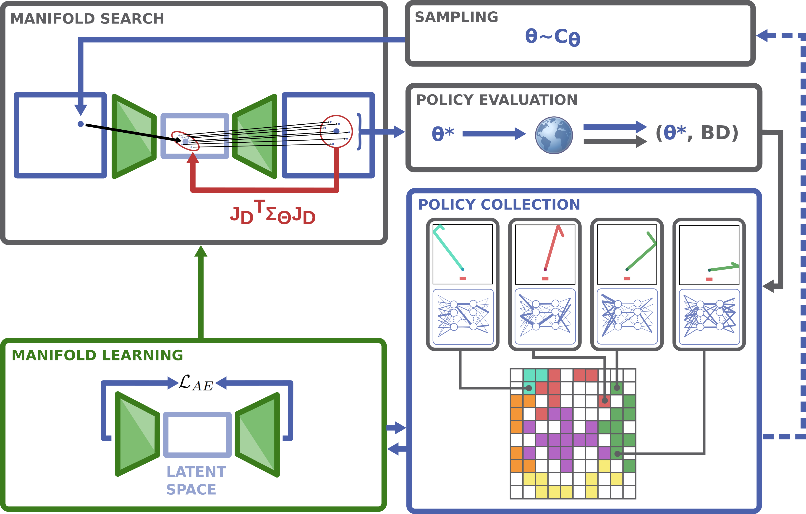
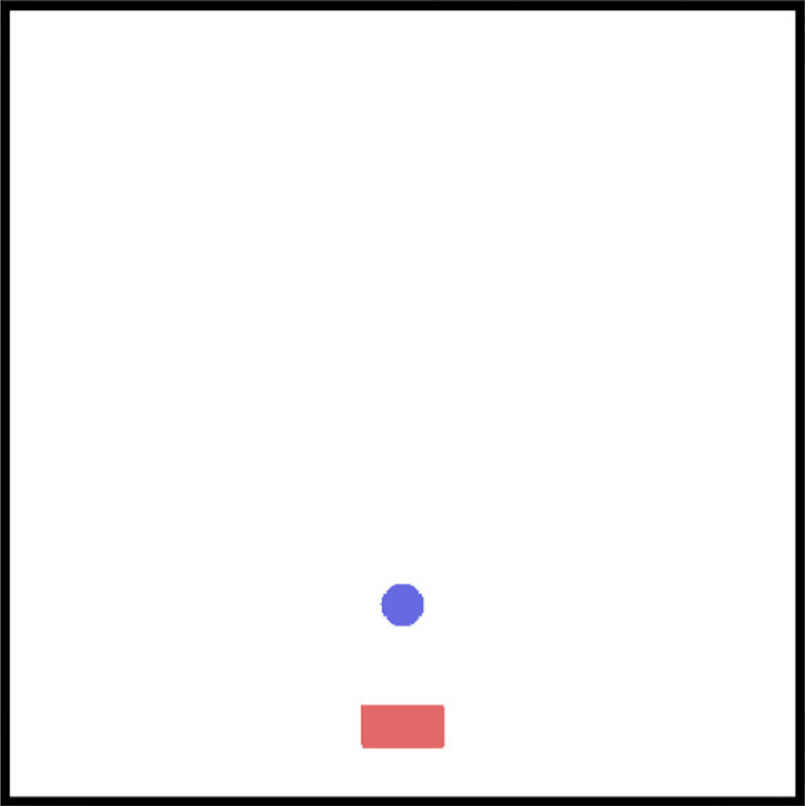

# Policy Manifold Search: <br>Exploring the Manifold Hypothesis <br>for Diversity-based Neuroevolution

Python implementation of the algorithms and experiments presented in the GECCO 2021 paper.

<p align="center">
   <a href="https://">Full paper</a> |
   <a href="https://sites.google.com/view/policy-manifold-search">Project website</a>
</p>


## Motivation and Problem Formulation


The main goal is to leverage learned representations of the policy network parameters, and perform policy search in this learned representation space.

This is done by using the Quality-Diversity framework for creating a collection of policies, and using them to learn the representations, with the use of an Autoencoder.
The collection consists of different policies, which exhibit diverse behaviours when executed in an environment, according to the behaviour descriptor.

When performing the policy search in the latent space, it is necessary to consider the additional transformaiton caused by the decoder. This transformation is accounted for by introducing Jacobian scaling of the latent space sampling covariance matrix.

The proposed approach is evaluated on four robotic environments in simulation, and compared to baselines.


## Framework Diagram




## Experiments

The approach has been evaluated on four simulated robotic environments, implemented in Box2d and PyBullet.


Biped-Walker | Biped-Kicker | 2D-Striker | Panda-Striker
:-------------------------:|:-------------------------:|:-------------------------:|:-------------------------:
 |  |  |  

---

# Using the code


__Prerequisites:__ Conda, Python 3


## Installation

Navigate to the base installation directory, in which to download the repository:
```
cd <INSTALL_PATH>
```


Download repository:

```
git clone https://github.com/nemanja-rakicevic/policy_manifold_search.git
cd policy_manifold_search

export POMS_PATH=$(pwd)

```


Set up Conda environment with all dependencies:<br>
(you can choose CPU `behrep_env_cpu.yml` or GPU `behrep_env_gpu.yml` version)

```
conda env create -f behrep_env_cpu.yml

conda activate behrep_env_cpu
```


Install repository:

`pip install -e . ; python setup.py clean`

(If there is some issue with Box2D so you might have to do: `pip install box2d`)

This automatically adds `$POMS_PATH` to `$PYTHON_PATH`.


##  Training

Basic usage example:

```
cd $POMS_PATH/behaviour_representations

python main_training.py --config_file <PATH_TO_EXPERIMENT_CONFIG_FILE>
```

You can run each of the experiments from the paper, by replacing 
`<PATH_TO_EXPERIMENT_CONFIG_FILE>` with the appropriate 
experiment config directory, and the algorithm within it.

For example, to replicate the PoMS algorithm for the Bipedal-Walker experiment, 
you should execute:

`python main_training.py --config_file config_experiments/bipedal_walker/nn_policy__poms.json`

By default only one seed is ran (the median-performing seed). 
You can change the seed or any other hyperparameter by adding command 
line arguments, which will overwrite the default arguments from the config file. 

For example:

`python main_training.py --config_file config_experiments/bipedal_walker/nn_policy__poms.json --seed_data 500 --ae_param__num_epochs 5000 --num_loops 11`


## Plotting

By default, after the execution has terminated, plots showing the achieved 
trajectories, policy collection and parameter spaces at each loop,
are generated and saved in the corresponding experiment directory.


To plot the trajectories and policy collection separately, use:

`python analysis/plot_bd_fromfile.py -load <PATH_TO_EXPERIMENT_SEED_DIR> -t traj bd`


If multiple algorithms are executed, they will be grouped by environment name in the 
same directory.

In order to compare their performances, it is possible to obtain the behaviour 
coverage plots of multiple experiments by running:

`python analysis/plot_performance.py -load <PATH_TO_ALL_EXPERIMENTS_DIR>`


---

# Reference

```
TBA
```


---

# Open Problems

Below, we offer a list of possible avenues for extending the Policy Manifold Search approach. 
If interested in working on any of these, feel free to contact n.rakicevic@imperial.ac.uk

1. In the current version, the policy is parameterised as a fully-connected neural network. 
Instead of using network parameters of a fixed network architecture, it would be interesting to allow the  architecture to be an adjustable parameter as well.
In this way, it would be possible to search in the space of policy parameters and architectures, which leads to a more generic approach. One possible way would be to represent the full network topology use a graph, and investigate graph representation methods.

2. The sampling of policies from the collection for performing mutations is currently done by uniform sampling. This could be improved by using certain properties of the policies already in the collection, in order to sample more intelligently. The goal would be to select policy parameters which, when mutated, are more likely to lead to diverse behaviours.

3. Investigate potential usages of the learned policy collection with diverse behaviours, within the Hierarchical RL framework.

4. Try new reward-less environments.

